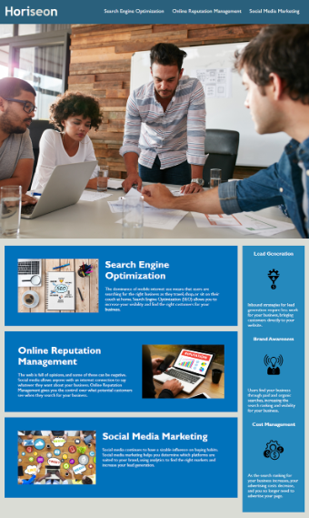

# <RefactoringPage>

## Description

Digital Marketing Page for Horiseon. This project is built to explain different aspects of digital marketing to users. The main goal is to educate users on the importance of digital marketing.

As a marketing agency, the goal is to have a codebase that follows accessibility standards to make the site optimized for search engines. 

## Installation 
N/A

## Usage
To use this Horizon Page, you can review each tab that will bring you to a description of it. You will also see a list of topics that are important to Digital Marketing along the side of the page. You will also notice the code for the webpage meets the accessibility standards. 

When I view the source code, I find semantic HTML elements.
When I view the structure of the HTML elements, I find that the elements follow a logical structure independent of styling and positioning.
When I view the icon and image elements, I find accessible alt attributes.
When I view the heading attributes, they fall in sequential order.
When I view the title element, I find a concise, descriptive title.

## 

## Link 
https://cassiewatsonn.github.io/RefactoringPage/#social-media-marketing

## Credits 
N/A 

## License

MIT License

Copyright (c) [2023]

Permission is hereby granted, free of charge, to any person obtaining a copy
of this software and associated documentation files (the "Software"), to deal
in the Software without restriction, including without limitation the rights
to use, copy, modify, merge, publish, distribute, sublicense, and/or sell
copies of the Software, and to permit persons to whom the Software is
furnished to do so, subject to the following conditions:

The above copyright notice and this permission notice shall be included in all
copies or substantial portions of the Software.

THE SOFTWARE IS PROVIDED "AS IS", WITHOUT WARRANTY OF ANY KIND, EXPRESS OR
IMPLIED, INCLUDING BUT NOT LIMITED TO THE WARRANTIES OF MERCHANTABILITY,
FITNESS FOR A PARTICULAR PURPOSE AND NONINFRINGEMENT. IN NO EVENT SHALL THE
AUTHORS OR COPYRIGHT HOLDERS BE LIABLE FOR ANY CLAIM, DAMAGES OR OTHER
LIABILITY, WHETHER IN AN ACTION OF CONTRACT, TORT OR OTHERWISE, ARISING FROM,
OUT OF OR IN CONNECTION WITH THE SOFTWARE OR THE USE OR OTHER DEALINGS IN THE
SOFTWARE.